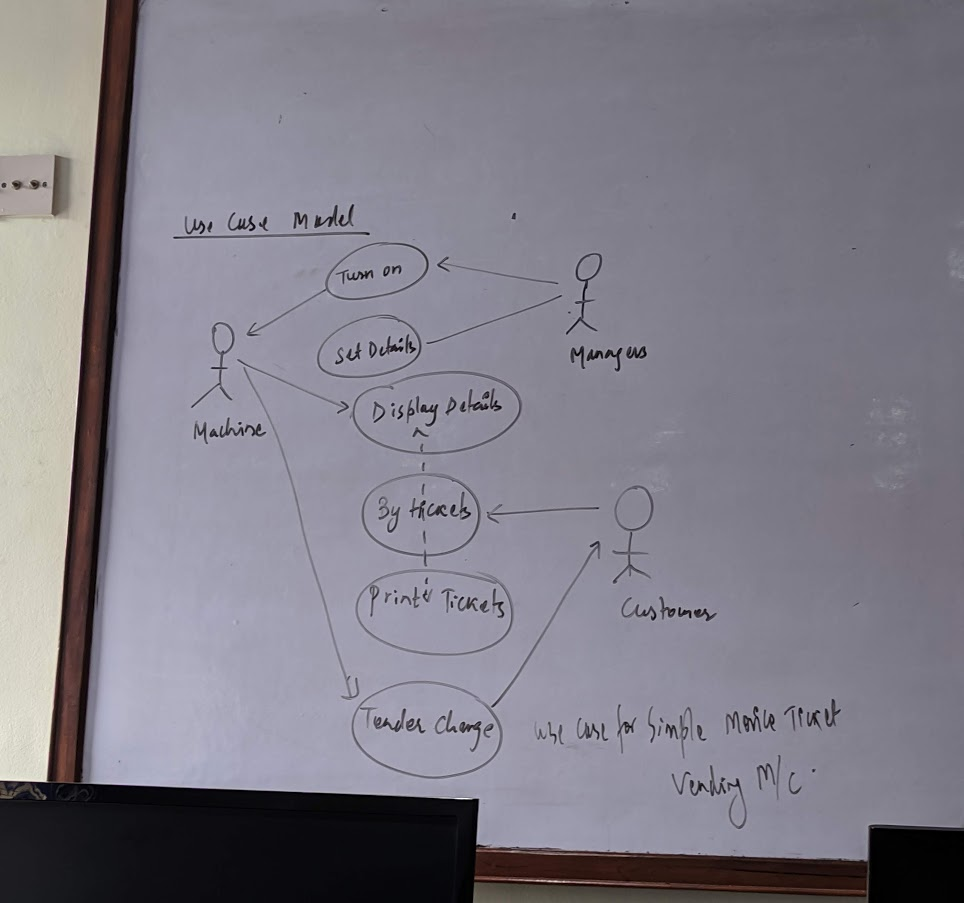
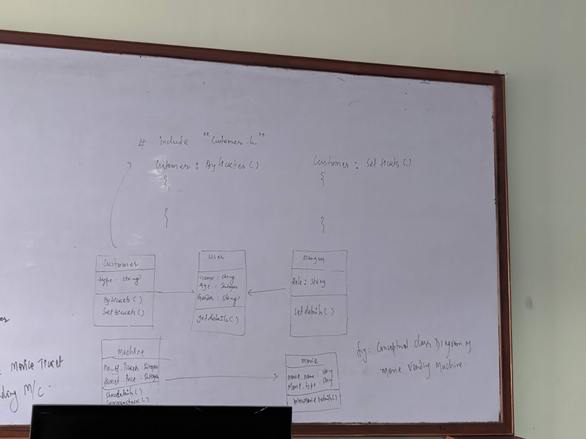
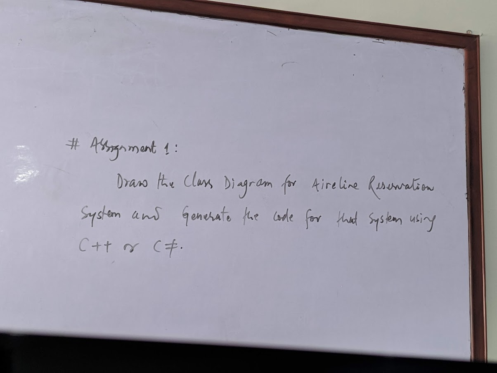
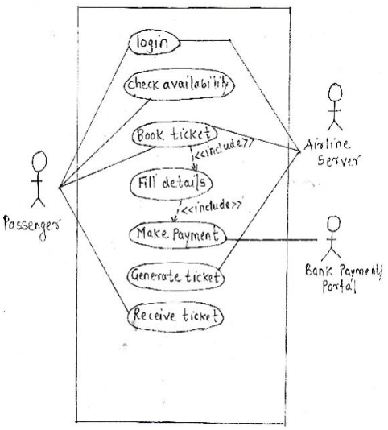

### Rational Rose 
Rational Rose is an object-oriented Unified Modeling Language (UML) software design tool intended for visual modeling and component construction of enterprise-level software applications.

We will study it later. Need to download cracked.

https://www.ibm.com/support/pages/ibm-rational-rose-enterprise-7004-ifix001

# Assignment 01

### Example for Assignment 1

### Assignment 1 Question

### Use Case Diagram Airline Reservation System

Use Case, Class Diagram, Coding in C or C# of Class Diagram need to be done.
